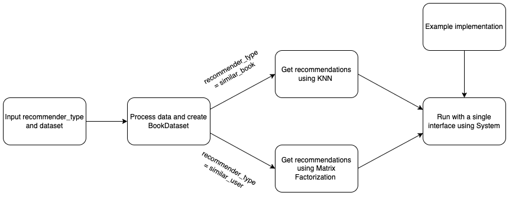

# Component Specification

## Process Data
Input: dataset\
Creates a class (BookDataset) for the dataset with various operations. Includes methods to read, clean, split and return the dataset as well as add new data. 

## Recommender
* System\
Input: BookDataset\
A template class that reads a BookDataset object containing cleaned data, defines standard interfaces for implementing KNN and Matrix Factorization and filters the data further making it suitable for prediction.
* KNN\
Input: book, num_recommendations\
A wrapper class that uses KNN to get a list of book recommendations based on a particular book. Includes methods to create and fit a KNN model, and predict recommendations.
* Matrix Factorization\
Input: user, num_recommendations\
A wrapper class that uses Matrix Factorization (NMF) to get a list of book recommendations based on user preferences. Includes methods to create and fit an NMF model, and predict recommendations.

## System
Input: dataset\
Integrates the recommenders and datasets into a single interface for operation (class RSystem). Here are instructions for how a web developer would interact with the interface.

## Sample Implementation
Input: recommender_type
Includes code that loads data, builds models and provides recommendations depending on recommendation preference (similar_user or similar_book)

