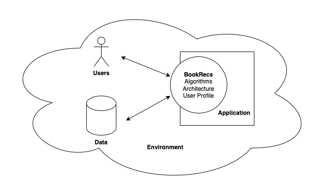

# Design Specifications

## Users
This package is mainly geared towards non-native users, such as web developers. Therefore, ease of inference and implementation is a key aspect of consideration. Flexibility is also significant, as the intended user base may be quite diverse. This package supports these user motivations and requirements by providing insightful recommendations while being transparent and explainable so that the recommendation generating process is easy to understand. The interfaces, annotations, wrapper classes and intuitive implementations of KNN and Matrix Factorization are consistent with these requirements. It can be used from a single or multiple devices. 
## Data
The recommender works on structured data. While designing code, special attention was given to the quality and quantity of data to account for potential lack of information and eliminate any potential biases. High-quality, expressive metadata was included to distinguish each component and object regardless of surface-level similarity of interaction. The design also ensured that volume of items was not too high. It considers the specific context and stability of book data within the general realm of recommendation systems.
## Application
This package is meant to be major service provided by the application hosting it (in our case a website), while enabling easy access to book recommendations that were previously difficult to obtain in such a context while maintaining efficiency. It includes both content-based and collaborative recommenders to cater to differing user needs. It can be integrated with an existing platform or website. The package can be used for browser-based and distributed applications. Depending on processing power, network connectivity and data constraints of the user, an application can be selected appropriately. In fact, this package supports a browser-based application environment for our primary intended use case of web deployment well, where the client requires minimum processing requirement to get book recommendations.
